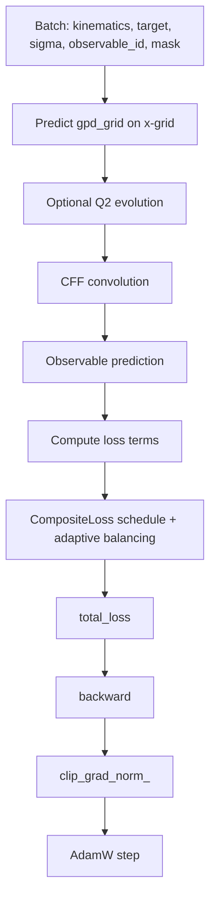

# Extract DVCS CFF: Detailed Framework Guide

This repository implements a physics-aware, differentiable pipeline for learning Generalized Parton Distributions (GPDs) from DVCS observables.

The framework combines:
- neural function approximation for GPD channels
- differentiable physics layers (Q2 evolution, CFF convolution, observable mapping)
- physics-informed regularization and constraints
- uncertainty quantification through pseudo-data replicas

This document explains exactly how the framework operates, including the precise neural architecture used in the shipped example config.

## 1. End-to-End Operating Principle

At training time, the model does not directly regress GPD values at measured points. Instead, it learns GPD functions that, after passing through differentiable physics layers, reproduce measured DVCS observables.

```mermaid
flowchart LR
    A[Dataset records\nexperiment + observable + kinematics + uncertainty]
    B[GlobalDVCSDataset\nstandardized tensors]
    C[DataLoader\ntrain/validation batches]
    D[DVCSGPDModel\nEncoder + Backbone + Heads]
    E[gpd_grid B x Nx x 4\nchannels: H,E,Htilde,Etilde]
    F[Q2EvolutionLayer\noptional differentiable evolution]
    G[DifferentiableCFFConvolution\nprincipal-value integral]
    H[cff_stacked B x 4 x 2\nreal/imag per channel]
    I[TorchDVCSObservableLayer\nDVCS observable formulas]
    J[predicted observable per row]
    K[PhysicsLossTermComputer\nmisfit + constraints + regularizers]
    L[CompositeLoss\nschedule + adaptive weighting]
    M[total_loss]
    N[backward + grad clip + AdamW step]
    O[checkpoints + metrics + artifacts]

    A --> B --> C --> D --> E --> F --> G --> H --> I --> J
    C --> K
    H --> K
    E --> K
    J --> K
    K --> L --> M --> N --> O
```



## 2. Data Contracts and Tensor Shapes

- Row kinematics are stored as `[xB, xi, t, Q2, phi]`.
- The neural GPD model itself uses four variables `[x, xi, t, Q2]`.
- During training, an x-grid is generated for convolution (`Nx = convolution.x_grid_size`; default example uses 129).

Core tensors in one training batch:
- `kinematics`: `[B, 5]`
- `target`: `[B]`
- `sigma`: `[B]`
- `observable_id`: `[B]`
- `gpd_grid`: `[B, Nx, 4]`
- `cff_stacked`: `[B, 4, 2]`
- `pred_observables`: `[B]`

## 3. Exact Neural Network Architecture

The architecture is configurable. The exact structure below is for the provided example config:

- `configs/gpd_pipeline_example.yaml`
- Encoder: `input_dim=4, hidden_dim=64, output_dim=96`
- Backbone: 2 residual blocks, each depth 2, width 128
- Heads: shared tower enabled, `tower_hidden_dim=96`, `tower_depth=2`
- Output channels: `H`, `E`, `Htilde`, `Etilde`

### 3.1 Clear Architecture Flowchart (Example Config)

```mermaid
flowchart LR
    IN[Input vector\n[x, xi, t, Q2]] --> PRE[Preprocess\nlogit(x), logit(xi), signed_log1p_abs(t), log(Q2)]
    PRE --> ENC1[Encoder Linear 4->64\nGELU]
    ENC1 --> ENC2[Encoder Linear 64->96]

    ENC2 --> RB1[Residual Block 1\n(96->128->128)\nLayerNorm + GELU + Dropout 0.05\nSkip projection: Linear 96->128]
    RB1 --> RB2[Residual Block 2\n(128->128->128)\nLayerNorm + SiLU + Dropout 0.03\nSkip: Identity]

    RB2 --> SH1[Shared Tower Linear 128->96\nGELU + Dropout 0.02]
    SH1 --> SH2[Shared Tower Linear 96->96\nGELU + Dropout 0.02]
    SH2 --> SH3[Shared Tower projection\nLinear 96->96]

    SH3 --> OUT4[Channel heads\n4 x Linear 96->1\nOutputs: H,E,Htilde,Etilde]
    RB2 --> AUX1[Aux head: Linear 128->8\naux_cff]
    RB2 --> AUX2[Aux head: Linear 128->8\naux_mellin]
```

### 3.2 Layer-by-Layer Neurons, Weights, and Biases

The table below is generated from the instantiated model using `configs/gpd_pipeline_example.yaml`.

| # | Module | Type | In -> Out | Weights | Bias/Scale | Total Params |
|---|---|---|---|---:|---:|---:|
| 1 | encoder.feature_proj.0 | Linear | 4 -> 64 | 256 | 64 | 320 |
| 2 | encoder.feature_proj.2 | Linear | 64 -> 96 | 6144 | 96 | 6240 |
| 3 | backbone.blocks.0.mlp.0 | Linear | 96 -> 128 | 12288 | 128 | 12416 |
| 4 | backbone.blocks.0.mlp.1 | LayerNorm | 128 -> 128 | 128 (gamma) | 128 (beta) | 256 |
| 5 | backbone.blocks.0.mlp.4 | Linear | 128 -> 128 | 16384 | 128 | 16512 |
| 6 | backbone.blocks.0.mlp.5 | LayerNorm | 128 -> 128 | 128 (gamma) | 128 (beta) | 256 |
| 7 | backbone.blocks.0.skip | Linear | 96 -> 128 | 12288 | 128 | 12416 |
| 8 | backbone.blocks.1.mlp.0 | Linear | 128 -> 128 | 16384 | 128 | 16512 |
| 9 | backbone.blocks.1.mlp.1 | LayerNorm | 128 -> 128 | 128 (gamma) | 128 (beta) | 256 |
| 10 | backbone.blocks.1.mlp.4 | Linear | 128 -> 128 | 16384 | 128 | 16512 |
| 11 | backbone.blocks.1.mlp.5 | LayerNorm | 128 -> 128 | 128 (gamma) | 128 (beta) | 256 |
| 12 | heads.shared_tower.net.0 | Linear | 128 -> 96 | 12288 | 96 | 12384 |
| 13 | heads.shared_tower.net.3 | Linear | 96 -> 96 | 9216 | 96 | 9312 |
| 14 | heads.shared_tower.net.6 | Linear | 96 -> 96 | 9216 | 96 | 9312 |
| 15 | heads.channel_outputs.* | 4 x Linear | 96 -> 1 each | 384 | 4 | 388 |
| 16 | heads.aux_cff_head | Linear | 128 -> 8 | 1024 | 8 | 1032 |
| 17 | heads.aux_mellin_head | Linear | 128 -> 8 | 1024 | 8 | 1032 |

Total trainable parameters (example config): **115,412**.

Notes:
- Example config disables process/flavor/observable embeddings, so no embedding parameters are added.
- `heads.aux_observable_head` is disabled in the example config (`enable_observable_proxy_head: false`).

## 4. Weights, Biases, and Backpropagation

Each affine layer computes:

$$
y = W x + b
$$

For each `Linear(in, out)`:

$$
\#W = out \times in, \quad \#b = out
$$

For each `LayerNorm(width)`:

$$
\#\gamma = width, \quad \#\beta = width
$$

Backpropagation path:
- `total_loss.backward()` computes gradients through all differentiable modules
- gradients flow from observable-space losses back through:
  - observable formulas
  - CFF convolution
  - optional Q2 evolution
  - GPD network (encoder/backbone/heads)
- gradients are clipped with `clip_grad_norm_`
- optimizer update is AdamW

Update rule (conceptual):

$$
w \leftarrow \text{AdamW}(w, \nabla_w \mathcal{L}_{total})
$$

## 5. Training Step and Loss Construction

The training loop computes a composite objective from data fidelity plus physics constraints.



Loss terms used by `PhysicsLossTermComputer` and `CompositeLoss`:
- `L_DVCS`: data misfit in observable space
- `L_transform`: consistency between auxiliary CFF head and convolution-derived CFFs
- `L_forward`: forward-limit consistency (if PDF provider supplied)
- `L_sumrule`: first-moment consistency with form factors
- `L_polynomiality`: moment-vs-xi polynomiality soft penalty
- `L_positivity`: soft positivity penalty
- `L_evolution`: forward/backward evolution consistency
- `L_smooth`: x-curvature regularization
- `L_regularization`: L2 on trainable parameters

Composite objective:

$$
\mathcal{L}_{total}(e) = \sum_i \lambda_i(e)\,\mathcal{L}_i
$$

where $\lambda_i(e)$ is epoch-dependent (curriculum schedule) and can be adaptively rebalanced by inverse EMA magnitude.

## 6. Physics Layers in the Differentiable Path

### 6.1 Q2 Evolution
- `Q2EvolutionLayer` applies channel-wise scaling with learnable anomalous-dimension parameters.
- Modes:
  - `differentiable`: analytic multiplicative evolution
  - `surrogate`: analytic baseline + learned residual correction MLP

### 6.2 CFF Convolution
- `DifferentiableCFFConvolution` performs principal-value style integration from `gpd_grid` to CFFs.
- Supports analytic singular-term handling near $x=\xi$.
- Output shape: `[B, 4, 2]` corresponding to real/imag parts of `[H, E, Htilde, Etilde]`.

### 6.3 Observable Layer
- `TorchDVCSObservableLayer` maps CFFs and kinematics to measurable observables.
- Current training IDs (`TORCH_OBSERVABLE_INDEX`):
  - `cross_section_uu`
  - `cross_section_difference_lu`
  - `beam_spin_asymmetry`
  - `beam_charge_asymmetry`
  - `double_spin_asymmetry`

## 7. Uncertainty Quantification

Replica uncertainty is implemented with pseudo-data generation:
- `generate_replicas(values, errors, n_replicas, seed)` creates Gaussian replicas
- either diagonal-error or covariance-based sampling
- replicas can be turned into full cloned datasets for ensemble training

This supports uncertainty bands and replica statistics at inference/evaluation time.

## 8. Inference Pipeline

`DVCSPredictor` performs forward inference:
1. load trained weights with `load_checkpoint_for_inference`
2. evaluate `predict_gpd_on_grid`
3. compute CFFs by convolution
4. map to requested observables

Output container (`PredictorOutput`):
- `gpd_grid`
- `cff_stacked`
- `observables`

## 9. Practical Usage

### 9.1 Install

```bash
pip install -e .
```

### 9.2 Run Unit Tests

```bash
pytest -q
```

### 9.3 Run the End-to-End Example

```bash
python scripts/run_gpd_pipeline_example.py --config configs/gpd_pipeline_example.yaml --epochs 6
```

Expected outputs include:
- checkpoints in `outputs/gpd_example/checkpoints/`
- metrics and manifest artifacts in `outputs/gpd_example/artifacts/`
- diagnostic plots such as loss curves, GPD slices, and replica bands

## 10. Project Map (Key Modules)

- `src/extract_dvcs_cff/models/kinematics_encoder.py`: kinematics preprocessing and dense encoding
- `src/extract_dvcs_cff/models/gpd_backbone.py`: residual MLP trunk
- `src/extract_dvcs_cff/models/gpd_heads.py`: channel and auxiliary heads, full `DVCSGPDModel`
- `src/extract_dvcs_cff/physics/evolution.py`: differentiable Q2 evolution
- `src/extract_dvcs_cff/physics/cff_convolution.py`: differentiable GPD -> CFF convolution
- `src/extract_dvcs_cff/physics/observables.py`: observable mapping layer
- `src/extract_dvcs_cff/physics/constraints.py`: physics-constraint penalties
- `src/extract_dvcs_cff/losses/physics_terms.py`: individual loss terms
- `src/extract_dvcs_cff/losses/composite.py`: scheduled/adaptive loss combination
- `src/extract_dvcs_cff/data/dvcs_dataset.py`: unified mixed-experiment dataset
- `src/extract_dvcs_cff/training/trainer.py`: end-to-end training loop and checkpointing
- `src/extract_dvcs_cff/inference/predict.py`: checkpoint loading and inference API

## 11. Legacy CLI Note

The Typer CLI in `src/extract_dvcs_cff/cli.py` currently focuses on ingestion, pseudodata generation, likelihood, and diagnostics. The full DVCS->GPD differentiable training path is currently demonstrated through `scripts/run_gpd_pipeline_example.py`.

## License

See [LICENSE](LICENSE).
